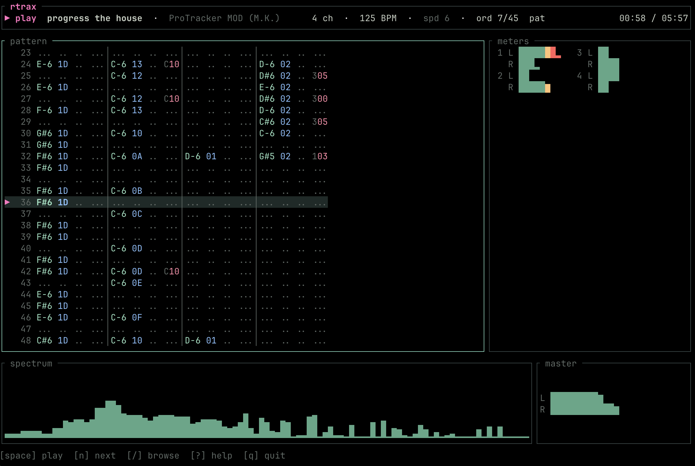

# rtrax

[](https://github.com/swilcox/rtrax/actions/workflows/ci.yml)
[](https://codecov.io/gh/swilcox/rtrax)
[](LICENSE)
[](https://www.rust-lang.org/)
[](https://doc.rust-lang.org/edition-guide/rust-2021/index.html)
[](#install)
[](https://github.com/ratatui-org/ratatui)
[](https://lib.openmpt.org/libopenmpt/)
[](https://github.com/swilcox/rtrax/releases/latest)
[](https://github.com/swilcox/rtrax/commits/main)
[](https://github.com/swilcox/rtrax)
[](https://github.com/swilcox/rtrax)

A TUI module player for `.mod` / `.xm` / `.it` / `.s3m` / `.mtm` (and anything
else libopenmpt reads). Per-channel level meters, scrolling pattern view,
master spectrum analyzer, file browser. macOS, Linux, and Windows.



> The image above is a placeholder mockup — swap in a real terminal capture
> by overwriting `docs/screenshot.png`.

## Install

### Windows (prebuilt bundle)

No toolchain needed. A self-contained bundle is attached to every
[release](https://github.com/swilcox/rtrax/releases/latest) under **Assets** as
`rtrax-windows-x64.zip`:

1. Download `rtrax-windows-x64.zip` from the latest release and unzip it.
2. Keep `rtrax.exe` and the bundled `.dll` files together in one folder.
3. Run `rtrax.exe` — pass a module path (`rtrax.exe song.xm`) or launch with no
   argument to open the file browser.

The zip ships libopenmpt, its audio dependencies, and the MSVC runtime DLLs, so
**nothing else needs installing** — no Visual C++ redistributable required. For
the best rendering (truecolor, Unicode box-drawing), run it from
[Windows Terminal](https://aka.ms/terminal). If SmartScreen warns about an
unsigned binary, choose **More info → Run anyway**.

### macOS / Linux (build from source)

libopenmpt is a runtime dependency, installed as a system library:

```sh
# macOS
brew install libopenmpt

# Debian / Ubuntu
sudo apt install libopenmpt-dev

# Arch
sudo pacman -S libopenmpt
```

Then build with cargo:

```sh
cargo build --release
```

If the linker can't find libopenmpt, set `RTRAX_OPENMPT_LIB_DIR` to its
location, or make sure `pkg-config --libs libopenmpt` returns a `-L` path.

## Run

```sh
# Launch the TUI; loads a file immediately if given.
cargo run --release -- some_song.xm

# Headless: play a file to the end, no UI.
cargo run --release --example play -- some_song.xm

# Smoke test: just print metadata.
cargo run --release --example load_print -- some_song.xm
```

Release-mode is meaningful — debug-mode FFT + decode can underrun the audio
buffer on modest hardware.

## CLI options

```
rtrax [OPTIONS] [FILES]...
```

| Option | Description |
|--------|-------------|
| `[FILES]...` | Module file(s) or a directory. Two or more files become an inline playlist (queue mode); a single directory opens the browser there. |
| `-l`, `--playlist <FILE>` | Load an M3U playlist. Alone, it plays as a queue (`n`/`p` walk it, Enter jumps). With a file/directory argument, it becomes the save target for `a` while you browse. |
| `-z`, `--shuffle` | Start with shuffled play order (toggle at runtime with `z`). |
| `--theme <THEME>` | Override the theme from config (e.g. `neon-blue`, `c64`, `mono`). |
| `--no-config` | Skip the config file and use built-in defaults. |
| `-h`, `--help` | Print help. |
| `-V`, `--version` | Print version. |

## Playlists

> Full details: [docs/playlists.md](docs/playlists.md)

rtrax uses the standard M3U format — plain text, one file path per line,
lines starting with `#` are comments or metadata and are ignored.

rtrax has two modes, chosen by how you launch it:

**Play a playlist (queue mode)** — `--playlist <file>` on its own:

```sh
rtrax --playlist my-favourites.m3u
```

The left panel becomes the **queue**: it lists the playlist's tracks, marks the
now-playing one, `n`/`p` and auto-advance walk it, and pressing `/` then `Enter`
on a track jumps straight to it.

**Build a playlist (browse mode)** — a file or directory *plus* `--playlist`:

```sh
# Browse ~/mods, audition tracks, press `a` to add keepers to favourites.m3u
rtrax --playlist favourites.m3u ~/mods
```

Here the left panel is the **file browser** and `n`/`p` walk the folder. The
playlist is purely the save target: press `a` to append the currently-playing
track to it. This is the "listen, and keep the ones you like" workflow.

You can also just browse a directory (`rtrax ~/mods`) or play a loose set of
files as an inline queue (`rtrax *.xm`).

**Adding songs while playing:**

Press `a` to append the currently-playing file to the playlist. Without a
`--playlist` target, the song is saved to the default playlist at:

- **Linux:** `~/.local/share/rtrax/playlist.m3u`
- **macOS:** `~/Library/Application Support/rtrax/playlist.m3u`
- **Windows:** `%LOCALAPPDATA%\rtrax\playlist.m3u`

The file is created automatically (with an `#EXTM3U` header) if it doesn't
exist yet. Pressing `a` multiple times is safe — each press appends one entry.

## Shuffle

Press `z` to toggle shuffled play order, or start shuffled with `--shuffle`
(`-z`). Shuffle applies to whatever drives playback: the playlist in queue mode,
or the folder's modules in browse mode. Toggling on anchors the currently-playing
track at the head, so playback continues from where it is. When shuffle is
active, a `⤮ shuffle` marker shows on the status line and in the queue/browser
panel title.

## Keybindings

| Key       | Action                       |
|-----------|------------------------------|
| `space`   | Play / pause                 |
| `s`       | Stop                         |
| `n` / `p` | Next / previous (queue or folder) |
| `a`       | Add current song to playlist |
| `z`       | Toggle shuffle (random order) |
| `←` / `→` | Seek −5 s / +5 s             |
| `[` / `]` | Gain down / up               |
| `\`       | Reset gain to unity (0 dB)   |
| `/`       | Focus browser / queue        |
| `Enter`   | Play selection (queue: jump to track) |
| `Tab`     | Cycle focus                  |
| `t`       | Cycle theme                  |
| `b`       | Cycle progress bar style     |
| `i`       | Toggle info panel (samples + metadata) |
| `m`       | Show full song message (scrollable) |
| `w`       | Cycle pattern stack (1 / 2 / 4 lanes); overrides auto-layout |
| `c`       | Toggle compact cells (drops volume + effect) |
| `?`       | Help overlay                 |
| `q`       | Quit                         |

Override any binding in `$XDG_CONFIG_HOME/rtrax/config.toml`.

## Gain

`[` and `]` adjust the master *gain* — libopenmpt's render mastergain, applied
to the decoded mix before it reaches the device (your OS volume is separate).
The default is unity (0 dB, no change); steps are 2 dB, ranging from −40 dB to
+12 dB. The current value flashes on the status line as you change it and is
always shown in the `master` meter's title. Press `\` to snap back to unity.

## Themes

Select a built-in or custom theme in `$XDG_CONFIG_HOME/rtrax/config.toml`:

```toml
theme = "default"
```

Built-ins are `default`, `high-contrast`, `sixteen`, `neon-blue`, `neon-green`,
`neon-orange`, `c64`, and `mono`. Custom themes live in
`$XDG_CONFIG_HOME/rtrax/themes/<name>.toml` and are selected by file stem:

```toml
theme = "amber"
```

```toml
# $XDG_CONFIG_HOME/rtrax/themes/amber.toml
extends = "default"

accent = "#ffb454"
note = "#ffe6a3"
instrument = "light-cyan"
volume = "yellow"
effect = "#ff7a90"
current_row_bg = "#302414"
```

Theme files may override any subset of these color keys: `bg`, `fg`, `fg_dim`,
`border`, `border_focus`, `accent`, `note`, `instrument`, `volume`, `effect`,
`meter_low`, `meter_mid`, `meter_high`, and `current_row_bg`. Values can be
`#rrggbb`, `reset`, or ratatui ANSI color names such as `cyan`, `dark-gray`,
and `light-magenta`. Pressing `t` cycles built-ins plus any `.toml` files found
in the themes directory. See [docs/themes.md](docs/themes.md) for the full
theme reference.

## Progress bar

The header shows a progress bar between the order/pattern stats and the time
display. Four styles are available:

| Style       | Looks like        | Notes |
|-------------|-------------------|-------|
| `triangle`  | `[━━━━▲────]`     | Single marker over an empty track |
| `blocks`    | `████▌    `       | Smooth fill via eighth-block chars (default) |
| `line`      | `━━━━╸────`       | Heavy elapsed, light remaining, notch at head |
| `segments`  | `▰▰▰▰▱▱▱▱`        | Discrete pip segments |

Pick one in config, or press `b` to cycle them at runtime:

```toml
progress_bar_style = "blocks"
```

## Pattern layout

By default the pattern view sizes itself to the module each time a new song
loads: a 4-channel MOD shows a single full-width lane, while denser modules fan
out into 2 or 4 stacked lanes and switch to compact cells so every channel stays
visible. Pressing `w` or `c` overrides the choice until the next song loads.

Turn the behavior off (and keep whatever `w`/`c` you set) in
`$XDG_CONFIG_HOME/rtrax/config.toml`:

```toml
auto_layout = true   # default; set to false to size lanes manually
```

## Architecture

See `PLAN.md`. In one paragraph: the audio thread owns the openmpt module and
the cpal stream. Inside the cpal callback it decodes interleaved f32 stereo,
copies a downsampled mono slice into an rtrb ring for the FFT, and updates
atomic snapshots of order/row/BPM/VU. The UI thread (~30 fps) reads those
atomics, drains the ring for FFT input, and renders a ratatui frame.
The cpal callback never allocates, locks (other than `try_lock`), or logs.

## Logs

Logs go to `$XDG_CACHE_HOME/rtrax/rtrax.log.YYYY-MM-DD` — file-only, never
stdout, because that would corrupt ratatui's alternate-screen rendering.

## Out of scope

- Editing / sample manipulation. Playback only.
- Network features, streaming protocols, web UI.
- Format conversion (libopenmpt is read-only here).
- Plugin systems, scripting, custom DSP effects.
